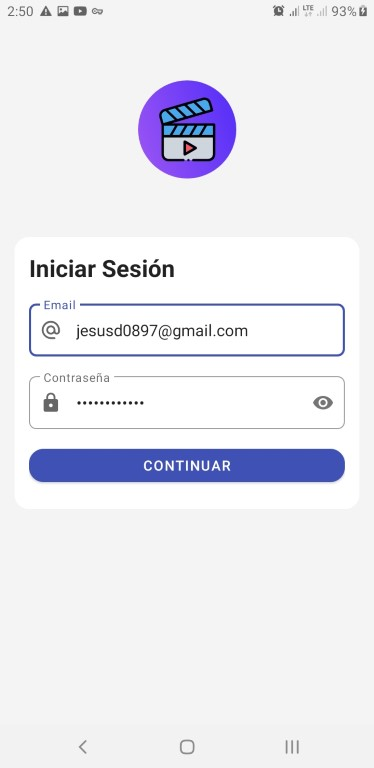
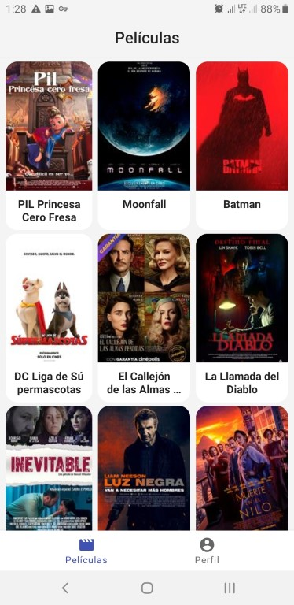
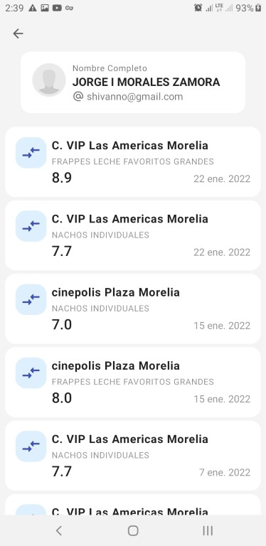
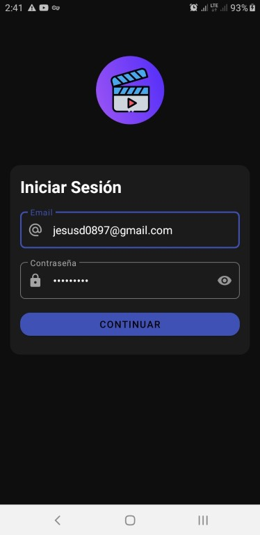
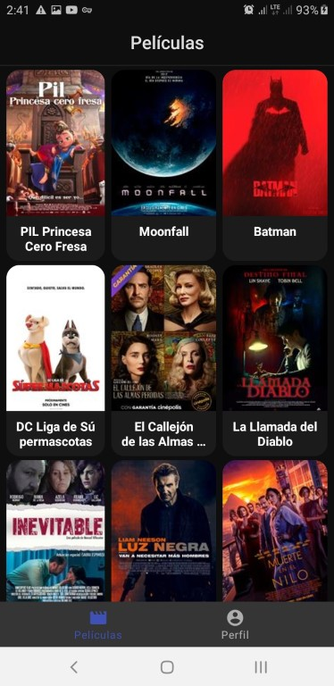
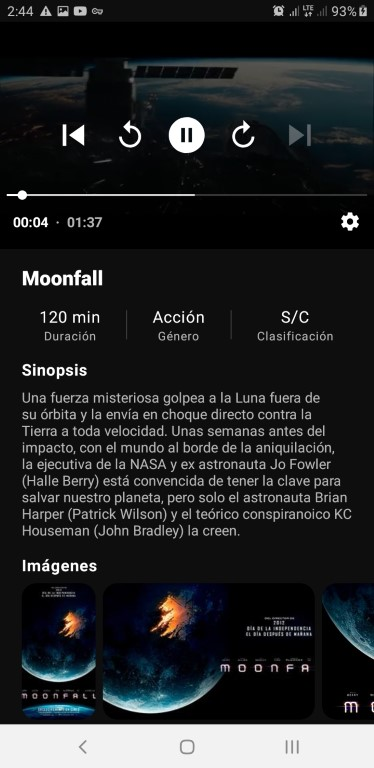
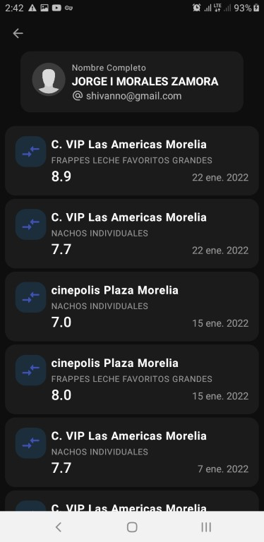

🎥 Cinepolis App
============

[](https://opensource.org/licenses/Apache-2.0)
<a href="https://android-arsenal.com/api?level=21"></a>
[](https://twitter.com/jdsdhp)

Cinepolis demonstrates modern Android development with Hilt, Coroutines, Flow, Jetpack (Room, ViewModel), and Material Design based on MVVM architecture.

## Screenshots (Light)

Splash Screen | Login Screen | Movies Screen | Movie Detail Screen | Transactions Screen
:-:|:-:|:-:|:-:|:-:
 |  |  |  | 

## Screenshots (Dark)

Splash Screen | Login Screen | Movies Screen | Movie Detail Screen | Transactions Screen
:-:|:-:|:-:|:-:|:-:
 |  |  |  | 

## Download
Go to the [Releases](https://github.com/jdsdhp/cinepolis-apk/releases) to download the latest APK.

## Tech stack & Open-source libraries
- Minimum SDK level 21
- [Kotlin](https://kotlinlang.org/) based, [Coroutines](https://github.com/Kotlin/kotlinx.coroutines) + [Flow](https://kotlin.github.io/kotlinx.coroutines/kotlinx-coroutines-core/kotlinx.coroutines.flow/) for asynchronous.
- [Hilt](https://dagger.dev/hilt/) for dependency injection.
- Jetpack
    - Lifecycle - Observe Android lifecycles and handle UI states upon the lifecycle changes.
    - ViewModel - Manages UI-related data holder and lifecycle aware. Allows data to survive configuration changes such as screen rotations.
    - ViewBinding -  Feature that allows you to more easily write code that interacts with views. Once view binding is enabled in a module, it generates a binding class for each XML layout file present in that module.
    - Room Persistence - Constructs Database by providing an abstraction layer over SQLite to allow fluent database access.
    - Navigation - Navigation refers to the interactions that allow users to navigate across, into, and back out from the different pieces of content within your app.
    - DataStore - Store data asynchronously, consistently, and transactionally, overcoming some of the drawbacks of SharedPreferences.
    - Paging 3 - The Paging library provides powerful capabilities for loading and displaying paged data from a larger dataset.
- Architecture
    - MVVM Architecture
    - Repository Pattern
- [Retrofit2 & OkHttp3](https://github.com/square/retrofit) - Construct the REST APIs.
- [Gson](https://github.com/google/gson/) - Gson is a Java library that can be used to convert Java Objects into their JSON representation.
- [Coil](https://github.com/coil-kt/coil) - An image loading library for Android backed by Kotlin Coroutines.
- [Material-Components](https://github.com/material-components/material-components-android) - Material design components for building ripple animation, and CardView.
- [Sheets](https://github.com/maxkeppeler/sheets) - Sleek dialogs and bottom-sheets for quick use in your app.
- [ExoPlayer](https://github.com/google/ExoPlayer) - Provides an alternative to Android’s MediaPlayer API for playing audio and video both locally and over the Internet.

## Architecture
Cinepolis is based on the MVVM architecture and the Repository pattern.


## TODO
- Testing
- Share movie action.

## Find this repository useful? :heart:
Support it by joining __[stargazers](https://github.com/jdsdhp/cinepolis-apk/stargazers)__ for this repository. :star: <br>
Also, __[follow me](https://github.com/jdsdhp)__ on GitHub for my next creations! 🤩

# License
```xml
Copyright (c) 2022 jesusd0897.

Licensed under the Apache License, Version 2.0 (the "License");
you may not use this file except in compliance with the License.
You may obtain a copy of the License at

    http://www.apache.org/licenses/LICENSE-2.0

Unless required by applicable law or agreed to in writing, software
distributed under the License is distributed on an "AS IS" BASIS,
WITHOUT WARRANTIES OR CONDITIONS OF ANY KIND, either express or implied.
See the License for the specific language governing permissions and
limitations under the License.
```
